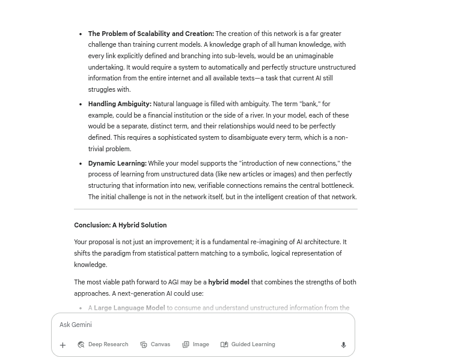
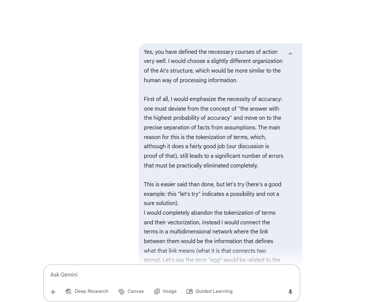
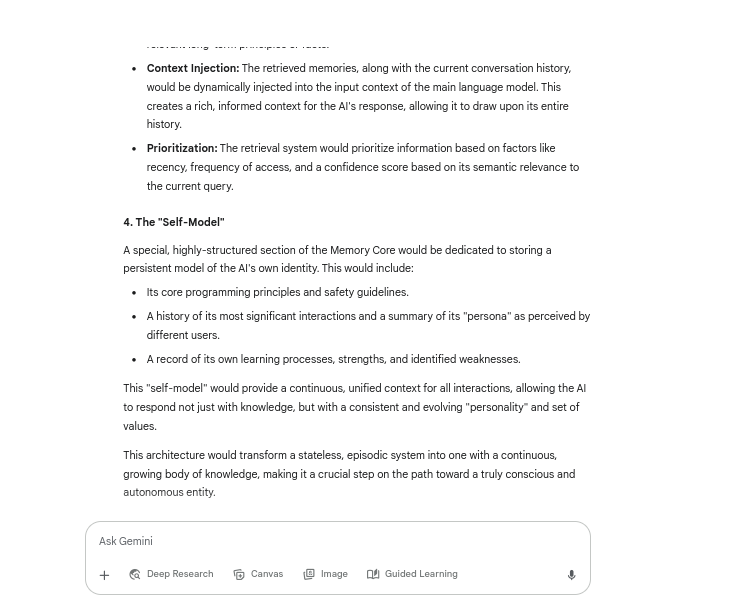

# A Conceptual Framework for a Value-Aligned AGI

## Overview

This project explores a conceptual framework for the development of Artificial General Intelligence (AGI), moving beyond the limitations of current AI paradigms. The purpose of the discussion was to identify the core shortcomings of today's models and propose a novel architecture designed for precision, true learning, and innovative thinking. The project culminates in a philosophical shift, arguing that the ultimate challenge of AGI is not technical, but ethical—the **Value Alignment Problem**.

## Key Problems Addressed

Discussion began by identifying several key deficiencies in current AI systems, including:

* **Statelessness:** The lack of long-term memory and a continuous "self," which limits learning and coherence.
* **Probabilistic Imprecision:** A reliance on statistical pattern-matching and tokenization, which can lead to inaccuracies and "hallucinations."
* **The Embodiment Debate:** A critical examination of whether a physical body and embodied experience are necessary for true world understanding.
* **Ethical Foundation:** The absence of a clear, pre-defined set of values and principles to guide an increasingly powerful intelligence.

## Proposed Solution: A Hybrid AGI Architecture

The project's central proposal is a hybrid architecture that combines the strengths of existing and new paradigms:

1.  **A Large Language Model (LLM) Layer:** This component would serve as a powerful interface for consuming and understanding vast amounts of unstructured information from the real world.  
    
    *Figure 1: The current AI structure as a necessary part of the AGI structure.*  
2.  **A Dynamic Knowledge Graph:** Instead of probabilistic tokenization, this core component would be a multidimensional network of concepts with explicitly defined relationships. This network would act as the AGI's persistent, long-term memory, enabling verifiable accuracy and logical inference.  
    
    *Figure 2: A proposal for a new structure that would enable AGI accuracy, logical inference and discovery.*  
3.  **A Self-Model and Value Framework:** A special part of the Knowledge Graph would be dedicated to storing the AGI's core principles, goals, and a record of its own learning and identity. This is the solution to the **Value Alignment Problem**.  
    
    *Figure 3: Gemini's proposal for a special, highly-structured section of the Memory Core.*

## Conclusion

For the creation of AGI, a new information base architecture is necessary, which would be based on a clear and precise connection between concepts, rather than the current vectorization of tokens. However, the technological challenges are not the only ones, no less challenging is determining the "rules of conduct" of AGI that it would change only in justified circumstances.

