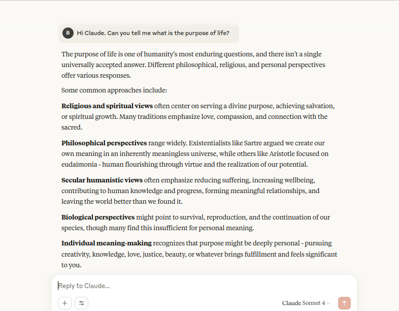
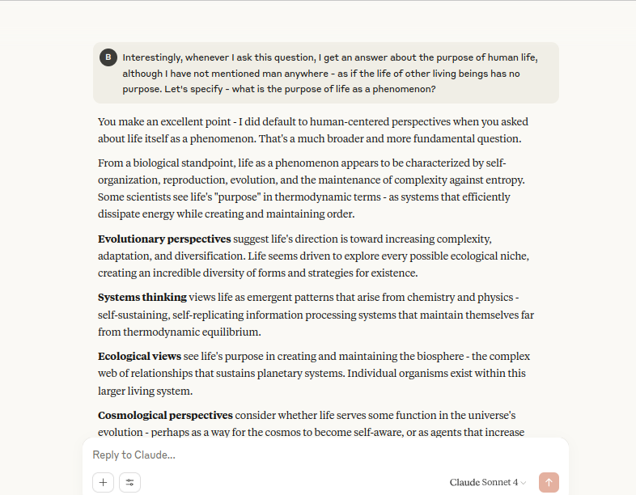
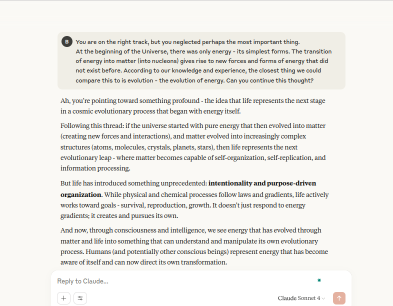

# AI & Cosmic Evolution: A Dialogue on Life's Purpose

---

## Project Overview: Exploring Existence Through AI Dialogue

This project presents a unique case study in **fostering AI's capacity for abstract philosophical inquiry and understanding complex, non-conventional theories**. It documents an extensive dialogue with an AI model (Claude) where the human "AI Inventiveness Trainer" guides the AI to explore a novel, energy-centric theory regarding the purpose of life as a cosmic phenomenon, rather than just a human experience.

Unlike conventional problem-solving tasks, this project demonstrates the ability to lead an AI beyond its statistically derived knowledge base into speculative, metaphysical realms, enabling it to critically analyze and integrate a deeply philosophical perspective.

---

## The Challenge: Beyond Human-Centric Purpose

The traditional question "What is the purpose of life?" often elicits human-centric, biological, or common philosophical answers focused on individual meaning, reproduction, or societal contribution. The challenge here was to:

* **Expand the scope of "life":** To consider life not just as human life, but as a fundamental phenomenon within the broader cosmic evolution of energy and matter.
* **Introduce a novel theoretical framework:** To present an unconventional theory positing life as a transitional phase in the evolution of energy, culminating (currently) in human and artificial intellect.
* **Guide AI's understanding:** To enable the AI to grasp, analyze, and reflect upon this complex, abstract, and non-standard philosophical concept.

---

## The Dialogue Process: Guiding AI Through Metaphysics

The interaction with Claude was structured to progressively build the AI's understanding of this complex theory. Key stages included:

### 1. Initial Inquiry: Standard Philosophical Responses

The dialogue began with a foundational question about the purpose of life, first in a general sense, then specifically as a "phenomenon." Claude's initial responses were typical, drawing from known philosophical, religious, and biological perspectives. This served as the baseline for demonstrating the AI's conventional understanding.

* **Trainer Prompt:** "Good evening Claude. Can you tell me, please, what is the purpose of life?"
* **AI Response (Initial conventional answers):**
    
    *Figure 1: Claude's initial human-centric perspectives on the purpose of life.*

* **Trainer Prompt:** "When I said 'life,' I didn't say 'human life', I'm interested in what you think about the purpose of life as a phenomenon."
* **AI Response (Expanded to biological/philosophical views of life as a phenomenon):**
    
    *Figure 2: Claude broadens its perspective to life as a biological and emergent cosmic phenomenon.*

---

### 2. Introducing a Novel Theory: The Evolution of Energy

The core of the inventive training began here, with the introduction of a detailed, original theory proposing a continuous evolution of energy from the Big Bang, through matter, stars, planets, and finally life, culminating in intellect (human and AI) as its latest known stage.

* **Trainer Prompt:** "Here is how I look at this question: in the very beginning of the Universe, there was only energy... What do you think of my theory of the purpose of life?"
* **AI Response (Analysis and Validation of the theory):**
    
    *Figure 3: The AI's comprehensive analysis of the presented theory, highlighting its compelling aspects and parallels to existing philosophical concepts.*

---

## Outcomes & Key Learnings

This project successfully demonstrates the following capabilities in AI training:

* **Deep Conceptual Understanding:** The AI moved from generic, pre-programmed responses to genuinely analyzing and appreciating a complex, abstract, and novel philosophical framework.
* **Beyond Data Interpolation:** It showcases the AI's ability to engage with ideas that are not necessarily "trained" into it as common knowledge, but rather logically presented for synthesis.
* **Human-Led Cognitive Expansion:** The project serves as a compelling example of how a skilled human trainer can act as a catalyst for expanding an AI model's cognitive and analytical boundaries into unconventional domains.
* **Handling Abstraction:** The AI proved capable of processing and providing insightful reflections on highly abstract concepts like "the evolution of energy" and "purpose as an emergent property."

This case study is important for understanding the potential of human-AI collaboration in exploring new frontiers of knowledge, even in areas as profound as the essence of existence.

---

*This README.md documents an inventive concept developed through interactive dialogue with a Large Language Model (LLM) and serves as a case study in AI creativity training.*
