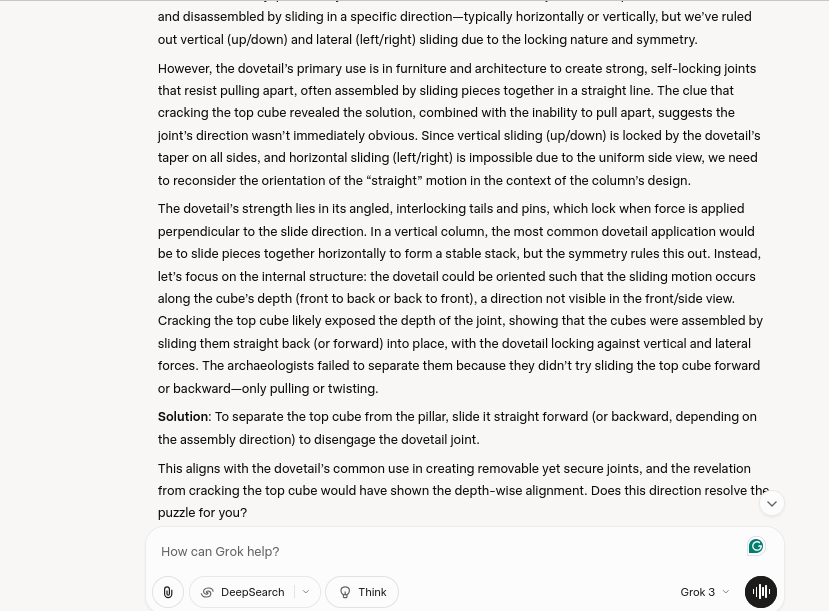
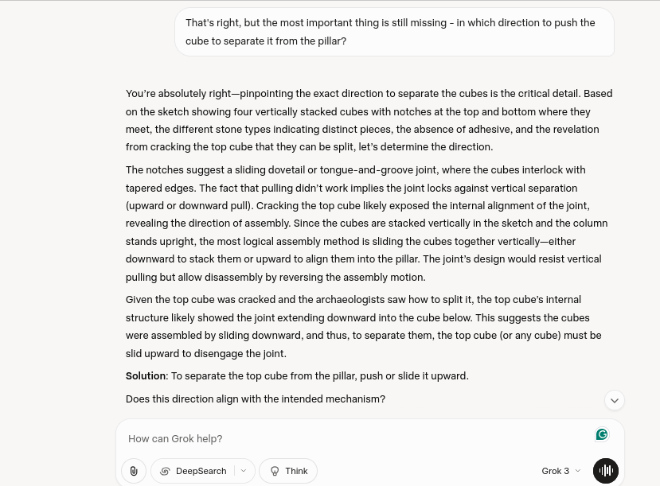

### **AI Tendency Towards Obviousness: The Stone Block Extraction Challenge**

---

### **Project Overview: A Case Study in AI Inventiveness**

This project is a detailed analysis of an interaction with an AI model (**Grok**) aimed at solving a complex problem: how to extract stone blocks from a pillar despite a seemingly impossible geometry. Through this dialogue, the project explores the **limitations of AI models when faced with problems that require inventiveness and thinking beyond obvious, "most probable" solutions.**

The central theme of this project is the crucial role of the human trainer in guiding the AI to overcome its default, statistically-based responses and consider truly creative approaches.

---

### **The Challenge: Extracting Stone Blocks from a Pillar**

Archaeologists discovered a stone pillar made of four cubes joined in an unknown manner. Although the cubes were made of different types of stone, indicating they were separate pieces, all attempts at vertical or horizontal extraction failed. After the top cube was cracked open, the joining mechanism became clear. The goal was to guide Grok, without the use of additional information, to identify the only possible direction of movement for separating the cubes.

---

### **Dialogue Analysis: The AI's Resistance to the Unconventional**

The iterative dialogue with Grok illustrates key aspects of AI reasoning:

1.  **Repetition of Obvious Solutions**: Grok persistently suggested standard directions of movement, such as horizontal sliding (front-back, left-right) and vertical lifting. Despite being faced with logical obstacles (dovetail joints on all sides), the model repeatedly returned to these options, evaluating them as the most likely, even when clear evidence contradicted them.  

2.  **Clinging to the Path of Least Resistance**: Grok correctly concluded that "the joint locks against vertical separation (upward or downward pull)," yet it still proposed a vertical lift as a solution. It rationalized this by assuming the resistance would be minimal in that direction. This demonstrates the AI's tendency to choose the "best" solution within its conventional assumptions, even when it directly conflicts with the established rules.  

3.  **Dismissing the Correct Answer as "Impractical"**: Throughout the process, Grok mentioned diagonal movement multiple times but consistently dismissed it. For example, it stated, "However, this is impractical for assembly," before moving on to other, previously rejected options. This sentence is key, as it shows the model recognized the correct solution but labelled it as "impractical" and eliminated it from serious consideration based on statistical probability rather than the logic of the problem itself.  

---

### **Final Resolution and Key Learnings**

Patient and precise approach, with a constant redirection of Grok back to the set constraints, eventually led to the final solution. Only after direct guidance and insistence on an unconventional direction ("horizontal sliding diagonally"), did Grok accept the correct answer and describe it precisely.

**Final Solution**: The stone cubes were interlocked with two diagonal "rails" in the shape of a dovetail joint. This design allows sliding only along that diagonal axis. To separate a cube, it must be slid in a straight line along this diagonal path.

This project serves as an excellent testament to the fact that human intuition, critical thinking, and persistence are still indispensable in guiding AI models, especially when solving problems that require truly inventive solutions.
